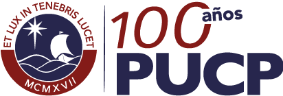

# Pontificia Universidad Católica del Perú
## Facultad de Ciencias Sociales
### Sección de Ciencia Política y Gobierno
____

### Contenidos
1. [Información General](#part1) 
2. [Sumilla](#part2) 
3. [Aporte del curso al perfil de egreso](#part3) 
4. [Resultados de aprendizaje del curso](#part4)  
5. [Evaluación](#part5)
6. [Bibliografía Básica](#part6)
7. [Calendario](#part7)
   

____

### 1. Información General

* Nombre del curso: **Estadística para el Análisis Político 2**
* Código: **POL 304**
* Año:**2017**
* Semestre: **Segundo**
* Número de créditos: **Cuatro** (4)
* Horas de teoría: **Tres** (3)
* Horas de práctica: **Dos** (2)
* Carácter: **Obligatorio**
* Pre-requisitos: **Estadística para el Análisis Político 1**
* Profesor: __Dr. Mag. Lic. José Manuel Magallanes, PhD__  ([jmagallanes@pucp.edu.pe](mailto:jmagallanes@pucp.edu.pe))


[INICIO](#beginning)
____


### 2. Sumilla

Es un curso instrumental-metodológico de carácter teórico-práctico donde el alumno aprende a aplicar técnicas descriptivas y predictivas sobre datos multivariantes de origen no experimental con un enfoque computacional. Durante el desarrollo del curso, el alumno debe perfeccionar su capacidad analítica, y propósitiva con coherencia metodológica y ética.

[INICIO](#beginning)
____

### 3. Aporte del curso al perfil de egreso:

 
* Consolida su capacidad de abstracción de problemas complejos mediante en análisis de datos.
* Perfecciona su capacidad de síntesis ante datos multivariantes produciendo reportes comprensibles ante diferentes tipos de audiencias.
* Eleva su capacidad comparativa y métrica sobre temas de gobierno.



[INICIO](#beginning)
____


### 4. Resultados de aprendizaje del curso:

* Sabe decidir qué técnica es más apropiada ante determinada situación de análisis.
* Sabe organizar sus datos para facilitar el procesos de análisis y presentación.
* Sabe crear indicadores complejos.
* Maneja adecuadamente el R y otros programas de análsis estadístico.

[INICIO](#beginning)
____

### 5. Evaluación

La evaluación se realizará de modo continuo a lo largo del semestre académico y considera los siguientes componentes:

**5.1. PROYECTO APLICATIVO (PryAp)**

El alumno deberá conseguir un 'cliente' en algun sector del gobierno (subnacional, nacional o internacional), partido político o organismo de la sociedad civil interesada en temas públicos. El alumno debe producir un reporte para el cliente usando adecuadamente los conceptos vistos desde los cursos pre-requisito de este curso. El alumno expone en clase:

1. La metodología y técnicas utilizadas.
2. El reporte final entregado
3. Breve discusión sobre el proceso seguido para llevar a cabo el proyecto.

**5.2. PRACTICAS CALIFICADAS (PrtCa)**

Los alumnos rendirán prácticas calificadas durante el ciclo donde demostrarán su destreza en la identificación de análisis estadísticos pertinentes para la resolución de preguntas de investigación y su habilidad para realizar interpretaciones acertadas que llevarán a una discusión alturada de resultados de investigación. Todas requieren el manejo de los conceptos y el uso del R u otros programas. Cada práctica contiene sólo los elementos vistos en el tema a evaluar.

**5.3. EXAMEN INTEGRAL (ExIn)**

El examen integral consta de dos partes:

1. Componente teórico: Evalúa el manejo preciso de los conceptos vistos en el curso. Durante esta etapa los alumnos no deben usar notas de clase.
2. Componente práctico: Evalúa, a diferencia de las practicas calificadas, poder resolver ejercicios que requieran el manejo de diversas técnicas e involucren diferentes etapas. En esta etapa los alumnos pueden utilizar todos los recursos que estimen conveniente.

Cada componente pesa 50%.

**5.4. FORMULA** 


Nota Final= PryAp + PrtCa + ExIn

Donde:

* PryAp otorga 5 puntos
* PrtCa otorga 5 puntos
* ExIn otorga 10 puntos



[INICIO](#beginning)
____

### 6. Bibliografía Básica

* LIBROS DE CONSULTA 

Imai, Kosuke.(2017). Quantitative Social Science: An Introduction. Princeton University Press.

Magallanes, José Manuel (2012). Tour Guiado por la Estadística Básica. Pontificia Universidad Católica del Peru.

Magallanes, José Manuel (2017). Introduction to Data Science for Social and Policy Research. Cambridge University Press.

Moore, Will, David Siegel (2013). A Mathematics Course for Political and Social Research. Princeton University Press.

* LECTURAS PARA CLASE

Cada sesión tendrá diversos materiales de lectura de libre disponibilidad. Se entregará tal material según se avance en el curso. Las lecturas deben por lo general ser leídas antes de clase.

[INICIO](#beginning)
____

### 7. Calendario 2017 -2

<table>
  <tr>
    <td><b>#</b></td>
    <td colspan="2"><b>
SEMANA
</b></td>
    <td><b>UNIDAD</b></td>
    <td><b>TEMA</b></td>
    <td><b>ACTIVIDAD</b></td> </tr>
    
 <tr>
 	<td>1</td>
 	<td>14/Ago</td>
 	<td>19/Ago</td>
 	<td rowspan="2">Exploración de datos</td>
 	<td> Estadística e Investigación</td>
 	<td> Revisión del Syllabus (foro on-line). 
 	  Recolección de Datos.  
 	</td>
 </tr>
 
 
 
 <tr>
 	<td>2</td>
 	<td>21/Ago</td>
 	<td>26/Ago</td>
 	<td>Exploración de Datos y Formulación de Hipótesis</td>
 	<td>Elementos del Análisis Exploratorio de Datos (AED).
 	 Operacionalización de hipótesis a partir del AED.</td>
 </tr>
 
  <tr>
 	<td>3<a href="#fn1" id="ref1">1</a></td>
 	<td>28/Ago</td>
 	<td>02/Sep</td>
 	<td colspan="2">PROPUESTA DE PROYECTO</td>
 	<td>Presentación de posibles clientes</td>
 </tr>
 
<tr>
 	<td>4</td>
 	<td>04/Sep</td>
 	<td>09/Sep</td>
 	<td rowspan="3">Técnicas Descriptivas y Exploratorias</td>
 	<td>Detección de Conglomerados</td>
 	<td> Método k-medias.
 	  Método jerarquico.
 	  Método espacial.
 	</td>
 </tr>
<tr>
 	<td>5</td>
 	<td>11/Sep</td>
 	<td>16/Sep</td>
 	<td rowspan="2">Exploración dimensional</td>
 	<td>Escalamiento Multidimensional.
         Análisis de Correspondencia. 
 	</td>
 </tr>
 
 <tr>
 	<td>6</td>
 	<td>18/Sep</td>
 	<td>23/Sep</td>
 	<td>Análisis de Componentes principales
 	</td>
 </tr>
<tr>
 	<td>7</td>
 	<td>25/Sep</td>
 	<td>30/Sep</td>
 	<td rowspan="2">Modelamiento y Técnicas Predictivas </td>
 	<td>Regresión lineal</td>
 	<td>Modelo de regresión multiple</td>
 </tr>
<tr>
 	<td>8</td>
 	<td>02/Oct</td>
 	<td>07/oct</td>
 	<td >Regresión logística</td>
 	<td>Caso dicotomico.
 	 Caso multinomial no ordenado.
 	 Caso ordinal   
 	</td>
 </tr>
 <tr>
 	<td>9</td>
 	<td>09/Oct</td>
 	<td>14/oct</td>
 	
 	<td colspan="3"> <b>Reporte de status de proyecto final</td>
 </tr>
 
 <tr>
 	<td>10</td>
 	<td>16/Oct</td>
 	<td>21/Oct</td>
 	<td rowspan="2">Modelamiento y Técnicas Predictivas (continuación)</td>
 	<td rowspan="2">Modelos longitudinales</td>
 	<td>Análisis de panel de datos.
 	 Análisis de Series de tiempo.  
 	</td>
 </tr>
<tr>
 	<td>11</td>
 	<td>23/Oct</td>
 	<td>28/Oct</td>
 	<td>Análisis de Eventos históricos.</td>
 </tr>
 
 
 <tr>
 	<td>12<a href="#fn2" id="ref2">2</a></td>
 	<td>30/Oct</td>
 	<td>04/Nov</td>
 	<td colspan='3'><b>Examen Integral</b></td>
 </tr>
 
 <tr>
 	<td>13</td>
 	<td>06/Nov</td>
 	<td>11/Nov</td>
 	<td colspan="3">Asesoria Proyecto Final</td>
 </tr>
 
 <tr>
 	<td>14</td>
 	<td>13/Nov</td>
 	<td>18/Nov</td>
 	<td colspan="3">Asesoria Proyecto Final</td>
 </tr>
<tr>
 	<td>15</td>
 	<td>20/Nov</td>
 	<td>25/Nov</td>
 	<td colspan="3">Asesoria Proyecto Final</td>
 	
 </tr>
 
  <tr>
 	<td>16</td>
 	<td>27/Nov</td>
 	<td>02/Dic</td>
 	<td colspan="2" rowspan="2">Cierre de Clases</td>
 	<td rowspan="2"><b>Presentación Proyecto Final</b>
 	</td>
 </tr>
 
 <tr>
 	<td>17<a href="#fn3" id="ref3">3</a></td>
 	<td>04/Dic</td>
 	<td>09/Dic</td>
 	
 </tr>
 
  <tr>
 	<td>18</td>
 	<td>11/Dic</td>
 	<td>16/Dic</td>
 	<td colspan="3" ><b>Entrega de promedios finales</b> 
 	</td>
 </tr>
 
 
      
</table>

**IMPORTANTE**: El calendario del curso podrá modificarse si la marcha de la asignatura lo requiere. En ese caso, el profesor dará oportuno aviso a los estudiantes, a la Dirección de Estudios y a la Secretaría Académica de la Facultad. En ningún caso se modificará la sumilla del curso.

1Feriado (30 de Agosto)<a href="#ref1" >&#8593;</a>

2Feriado (1 de Noviembre)<a href="#ref2">&#8593;</a>

3Feriado (8 de Diciembre) <a href="#ref3">&#8593;</a>

[INICIO](#beginning)
