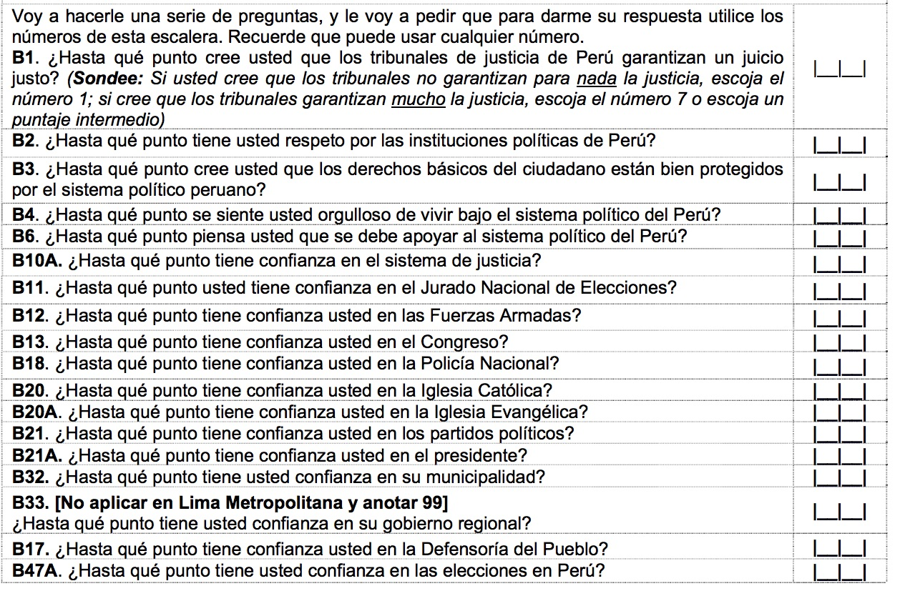
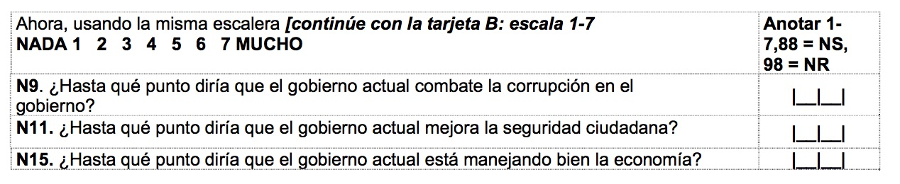
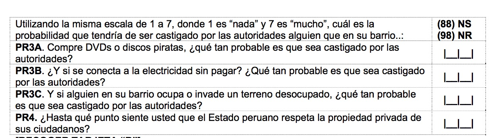

<br> 
<center></center>

## Course: Estadística Para el Análisis Político II<br> Semestre 2017-II<br> 
### Prof. José Manuel Magallanes, PhD 
____
## **Análisis Multivariado**

## Exploración Dimensional
____

<a id='beginning'></a>

Carguemos la data:
```{r, eval=FALSE}
folder='data'
fileName='idePeru2012.csv'
fileToRead=file.path(folder,fileName)
ide12=read.csv(fileToRead,strip.white = T)
```

Veamos estructura:

```{r, eval=FALSE}
str(ide12)
```

Sabiendo que varias columnas no tienen el formato adecuado:

```{r, eval=FALSE}
ide12=read.csv(fileToRead,strip.white = T,
                 colClasses=c(rep('character',4),
                              rep('numeric',7),
                              rep('factor',3)))
```

Ahora:

```{r, eval=FALSE}
str(ide12)
```


La variable TAMANO debe ser ordinal:
```{r, eval=FALSE}
ide12$TAMANO=as.ordered(ide12$TAMANO)
```


## Mapa de similitudes

Cuando hacemos _análisis de conglomerados_ asignamos cada provincia a un grupo. Pero a veces queremos ver cómo la distancia entre estos se puede representar. Es decir, si usamos las distancias entre ellos, ¿cómo sería ese mapa? Responder esta pregunta implica que creemos un mapa de provincias, pero NO uno geográfico, sino un mapa donde los distritos más similares en IDE estén más cerca.

Crear mapas basados en multiples valores es el objetivo del **escalamiento multidimensional**. Las múltiples variables serán los componentes del IDE:

```{r, eval=FALSE}
# Aquí están los componentes
provMap=ide12[,c(6:10)]

# Viendo resultado:
head(provMap)
```

El subconjunto de de arriba está bien, pero necesitamos que haya alguna manera de identificar las provincias. De ahi que mejor reemplazamos los numeros de fila por el ubigeo:

```{r, eval=FALSE}
row.names(provMap)=ide12$ubiProv

#viendo:
head(provMap)
```

Evidentemente, el nombre de fila debe ser único, y el ubigeo cumple esa característica.

Ahora nos toca hacer un par de pasos conocidos:
```{r, eval=FALSE}
# normalizar:
provMap_s=scale(provMap)

# hallar distancias entre ellos:
provMap_d=dist(provMap_s)
```

De aquí, en vez de calcular pertenencia a algun cluster, nos vamos a crear el mapa:

```{r, eval=FALSE}
provMap_r <- cmdscale(provMap_d,eig=TRUE, k=2) # k sugiere dimensiones
provMap_r$GOF # mientras mas cerca a 1 mejor.
```

Rapidamente podemos ver la posición de los puntos creados:

```{r, eval=FALSE}
titulo="Mapa de Similitudes entre provincias del Perú basado en el IDE"
x <- provMap_r$points[,1]
y <- provMap_r$points[,2]
plot(x, y, main=titulo)

```

Claro, este mapa necesita decoraciones. Primero mostremos etiquetas en vez de puntos:

```{r, eval=FALSE}
plot(x, y, xlab="Dimensión 1", ylab="Dimensión 2", main=titulo, 
     type="n") # 'n' evita que se pongan los puntos.
# etiquetas y colores de los puntos
columnForLabels=dimnames(provMap_r[[1]])[[1]]
text(x, y,labels = columnForLabels) 
```

Si quisieramos nombres en vez de ubigeos:

```{r, eval=FALSE}
plot(x, y, xlab="Dimensión 1", ylab="Dimensión 2", main=titulo, 
     type="n") # 'n' evita que se pongan los puntos.
# etiquetas y colores de los puntos
columnForLabels=ide12$PROVINCIA
text(x, y,labels = columnForLabels, cex = 0.5) 
```

Los nombres nos dan una idea de como se acercan unas provincias a otras. Podriamos colorear para dar más información:
```{r, eval=FALSE}
plot(x, y, xlab="Dimensión 1", ylab="Dimensión 2", main=titulo, 
     type="n") # 'n' evita que se pongan los puntos.
# etiquetas y colores de los puntos
columnForLabels=ide12$PROVINCIA
colorForLabels=ide12$COSTA
paleta=c('grey','blue')
text(x, y,labels = columnForLabels, cex = 0.8, col = paleta[colorForLabels]) 
legend("bottomright", legend = levels(colorForLabels),
       fill = paleta,title = "Tiene Costa?")
```

Podemos 'agregar' los datos por region:

```{r, eval=FALSE}
regionIde12=aggregate(cbind(IDENTIDAD,SALUD, EDUCACION,SANEAMIENTO, ELECTRIFICACION) ~ DEPARTAMENTO,data=ide12,FUN=mean)
regionIde12
```

Tenemos un nuevo data frame, hagamos el mismo tipo de trabajo:
```{r, eval=FALSE}
# subset:
regMap=regionIde12[,-1]

# renombrar fila
row.names(regMap)=regionIde12[,1]

# normalizar:
regMap_s=scale(regMap)

# hallar distancias entre ellos:
regMap_d=dist(regMap_s)

# calcular:
regMap_r = cmdscale(regMap_d,eig=TRUE, k=2) #
```


Verificando qué tan bueno es resultado:

```{r, eval=FALSE}
regMap_r$GOF # mientras mas cerca a 1 mejor.
```

Con ese resultado, podemos crear otro mapa:

```{r, eval=FALSE}
labelsMap=row.names(regMap)
x <- regMap_r$points[,1]
y <- regMap_r$points[,2]
plot(x, y,  main="Mapa IED nivel regiones",	type="n")
text(x, y, labels = labelsMap, cex=.5) 
```


## Mapas de modalidades

La data que tenemos tiene algunas columnas con valores categóricos. Podemos discretizar las demás variables numericas para tener más categorías.

Así, cambiemos el IDE y todos sus componentes a ordinal (5 niveles). Para ello, primero creemos cinco nuevas variables (estarán vacías):

```{r, eval=FALSE}
ide12$elcOrd=ide12$sanOrd=ide12$eduOrd=ide12$salOrd=ide12$idOrd=NA
```

Nótese que he creado las variables en un 'aparente; orden inverso; debo hacer eso para que en la data salgan en el orden deseado:
```{r, eval=FALSE}
names(ide12)
```


Ahora démosle valores a las variables recién creadas. Se crearán tres niveles en cada una, pero les daremos diferentes nombres para que se note el propósito de la técnica:

```{r, eval=FALSE}
gruposCantidad=3
###
etiquetas1=c('bajo','medio','alto')
ide12[,c(15:17)]=lapply(ide12[,c(6:8)],cut,
       breaks = gruposCantidad,
       labels = etiquetas1,
       ordered_result = T)

###

etiquetas2=c('malo','regular','bueno') # usando otra etiqueta
ide12[,c(18:19)]=lapply(ide12[,c(9:10)],cut,
       breaks = gruposCantidad,
       labels = etiquetas2,
       ordered_result = T)

```

Una mirada:
```{r, eval=FALSE}
summary(ide12[,c(15:19)])
```

```{r, eval=FALSE}
str(ide12)
```


Las modalidades, o los valores de las variables categóricas, se explora usando la tabla de contingencia:

```{r, eval=FALSE}
tablaTE=table(ide12$TAMANO,ide12$eduOrd)
prop.table(tablaTE)
```


Luego, con la prueba Chi-Cuadrado se pregunta si el comportamiento conjunto expresa asoción:
```{r, eval=FALSE}
chisq.test(tablaTE)
```

Se ha obtenido un resultado no confiable, pues algun requisito de la prueba no se puede sostener (hay celdas menores que 5, y hasta un cero). Lo bueno es que R alerta que podria ser incorrecto, y nos da una salida no paramétrica:

```{r, eval=FALSE}
chisq.test(tablaTE,simulate.p.value = T)
```

Si el valor del **p-value** es menor a **0.05**, se asume que hay asociación (formalmente estamos rechanzando la hipotesis nula: "la variables son independientes").


Hasta aqui sabemos que las variables están relacionadas, pero no tenemos mayor detalle de cómo es esa relación. Es aquí donde aparece el **análisis de correspondencias**. Éste es un análisis gráfico que permite conocer como se están asociando las categorías.

Se comienza por calcular la tabla de correspondencias, a partir de la tabla de contingencia:

```{r, eval=FALSE}
library(ca)
tablaCA_te=ca(tablaTE)
```


Este objeto tiene información interesante:
```{r, eval=FALSE}
tablaCA_te
```

Si revisamos los **eigenvalues** vemos que la tabla se ha descompuesto en dos dimensiones, y que la primera recoge la mayor información:

```{r, eval=FALSE}
plot.ca(tablaCA_te, col=c("red","blue"))
```

Queremos entender la relación entre las categorias de ambas variables. Para ello:
1. Debemos descartar las categorias cercanas al origen:

   * "alto" y "3" están cerca al origen. Solo podemos concluir que no están asociadas.

2. Miremos las categorias distanciadas del origen:

   * "medio" y "2" están relativamente más lejos, debe haber una ligera asociación. Como el ángulo entre ellas desde el origen es menor a 90, la asociación es positiva.
   * "bajo" y '4' y '5' están muy distanciadas del origen. El angulo entre ellas es mayor que 90, lo que sugiere una asociación negativa. 
   * "bajo" está  muy distanciada del origen, y '2' no tanto. Si '2' estuviese más cerca a 'bajo' sugeriría una asociación positiva fuerte.
   
Para ver los angulos podemos pedir:

```{r, eval=FALSE}
plot.ca(tablaCA_te, col=c("red","blue"), arrows = c(T,T))
```

## Buscando estructura 

Muchas veces nos enfrentamos a _conjuntos_ de preguntas que desean consultar sobre un mismo tema. Ese mismo tema es una variable _latente_, la cuál es un concepto abstracto dificilmente visto de manera empírica, por lo que usaremos variables _observables_ para acercarnos a su comprensión.

Una primera técnica que lidia con esto es el análisis de componentes principales (**PCA** por sus siglas en inglés). El PCA simplemente va a reducir las preguntas y devolver menos dimensiones (en eso se parece a lo visto antes), la diferencia es que ahora lo usaremos con variables ordinales.

Traigamos una data de LAPOP:

```{r, eval=FALSE}
library(haven)
fileName='PeruLAPOP2014.sav'
fileToRead=file.path(folder,fileName)
dataSpss=read_sav(fileToRead)
```

Tenemos la data, como viene de encuesta, preguntemos cuantas columnas hay:
```{r}
ncol(dataSpss)
```


Con esta cantidad de columnas no vale la pena verlas todas aquí, pues lo que necesitamos es algunos conjuntos de variables que buscan un concepto. 

Veamos un primer conjunto de preguntas (B1-B47A):


Dónde estarán esas variables entre las 208 que tenemos?
```{r}
grep("b", colnames(dataSpss) )
```

Como deben ser consecutivos, veamos que hay de la columna 56 a la 73:
```{r}
colnames(dataSpss)[c(56:73)]
```


Aqui tenemos otro:



```{r}
# solo son 3:
labelsCol1=c('n9','n11','n15')
which(names(dataSpss)%in%labelsCol1)
```

Y un tercer grupo:



Hacemos lo mismo:

```{r}
# solo son 3:
labelsCol2=c('pr3a','pr3b','pr3c','pr4')
which(names(dataSpss)%in%labelsCol2)
```

```{r}
set1=c(56:73)
set2=which(names(dataSpss)%in%labelsCol1)
set3=which(names(dataSpss)%in%labelsCol2)
#
columnasQueNecesito=c(set1,set2 ,set3)
columnasQueNecesito
```

Ahora si subconjunto:
```{r}
sub_dataSpss=dataSpss[,columnasQueNecesito]
```

Nos indican más arriba que no debemos aplicar la pregunta _b33_ a los de Lima. Será mejor eliminar esa columna:

```{r}
which(names(sub_dataSpss)%in%'b33')
```

Esa es la columna que necesitamos eliminar:
```{r}
sub_dataSpss=sub_dataSpss[,-16]
```

Ahora si lo usual:
```{r}
subTable=data.frame(sub_dataSpss)
```

```{r}
str(subTable)
```

Una descripción:
```{r}
summary(subTable,maxsum = 8)
```

Ahora hay que reemplazar esos valores perdidos:
```{r}
for(i in 1:ncol(subTable)){
  subTable[is.na(subTable[,i]), i] <- median(subTable[,i], na.rm = TRUE)
}
```


Ya tenemos tres conjuntos de variables, aqui debemos hallar una matriz de correlación. Sin embargo, considerando, dado que los datos son ordinales, debemos usarhallar la matriz policórica (en vez de la de correlación lineal de Pearson):
```{r}
library(psych)
Poly_cor <- polychoric(subTable)$rho
```

El tamaño de la muestra es el adecuado?

```{r}
KMO(Poly_cor)  #MSA: al menos 0.60, 0.9 es buenisimo.
```

Un tema importante, si vamos a trabajar con correlaciones, es saber si esta no es la matriz de identidad:

```{r}
cortest.bartlett(Poly_cor, n=nrow(subTable))
```


```{r}
smc(Poly_cor,covar = T)
```

```{r}
resultadoPr=principal(Poly_cor,3,rotate="varimax", scores=T)
print(resultadoPr,digits=3,cut = 0.4)
```


```{r}
regresFactors=factor.scores(subTable,resultadoPr)$scores
```

[Inicio](#beginning)

La idea es crear sólo quedarnos con esos grupos por ahora:

______


<br></br>

####[VOLVER AL SILABO](https://politicaygobiernopucp.github.io/EstadisticaPoliticaGobiernoII/)
